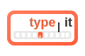

# TypeIt - Special Characters & Symbols Typing Tool



TypeIt is a comprehensive online tool for typing special characters, accent marks, diacritics, mathematical symbols, and characters from various languages. This project is a clone of the popular [TypeIt.org](https://www.typeit.org) website, built with modern web technologies.

## 🌟 Features

- **Multiple Language Support**: Type in 24+ languages including Czech, Danish, Dutch, Esperanto, Finnish, French, German, Greek, Hungarian, Icelandic, Italian, Maori, Norwegian, Polish, Portuguese, Romanian, Russian, Spanish, Swedish, Turkish, Ukrainian, Vietnamese, and Welsh.
- **Special Character Tools**: Access tools for typing mathematical symbols, general symbols, currency symbols, emoji, and IPA (International Phonetic Alphabet) characters.
- **User-Friendly Interface**: Simple, intuitive interface for easy typing and character selection.
- **Auto-Save**: Your text is automatically saved in your browser's local storage.
- **Copy to Clipboard**: Easily copy your text to use anywhere.
- **Responsive Design**: Works on desktop, tablet, and mobile devices.

## 🚀 Technologies Used

- [Next.js](https://nextjs.org/) - React framework for server-rendered applications
- [React](https://reactjs.org/) - JavaScript library for building user interfaces
- [TypeScript](https://www.typescriptlang.org/) - Typed JavaScript
- [Tailwind CSS](https://tailwindcss.com/) - Utility-first CSS framework
- [shadcn/ui](https://ui.shadcn.com/) - UI component library

## 📋 Prerequisites

- Node.js 18.x or higher
- npm or yarn

## 🛠️ Installation

1. Clone the repository:
   ```bash
   git clone https://github.com/saikothasan/typekit.git
   cd typekit

